# Concept Art

I asked various AI engines to come up with concept art for Vitni.

> **Verdict (2026-08-14).** None of it shipped as a whole; three ingredients from it did. The reasoning
> is in [Review](#review) at the bottom of this file — read that before proposing any of these again.
> The shipped design lives in
> [`docs/development.md`](../development.md#the-app-icon-and-the-brand-art).

## Gemini

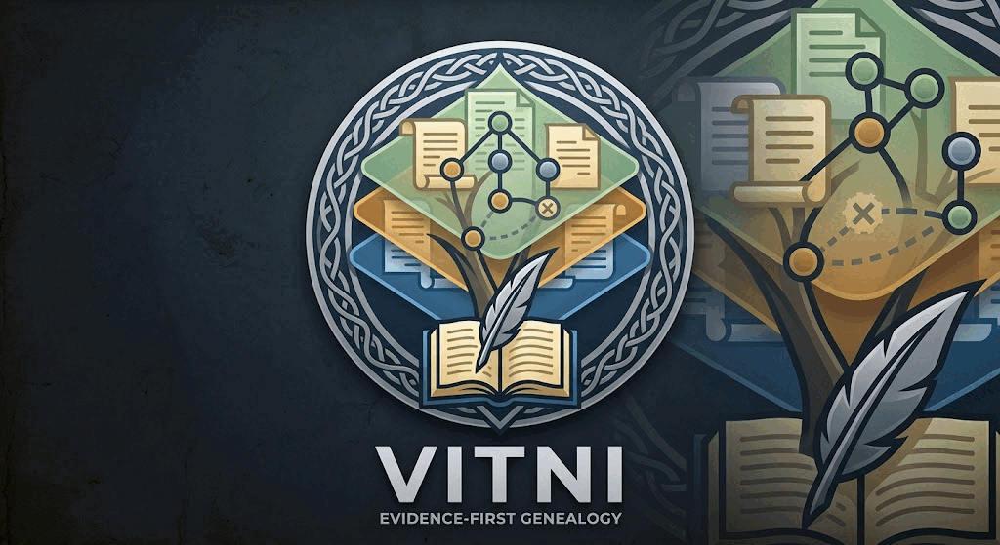

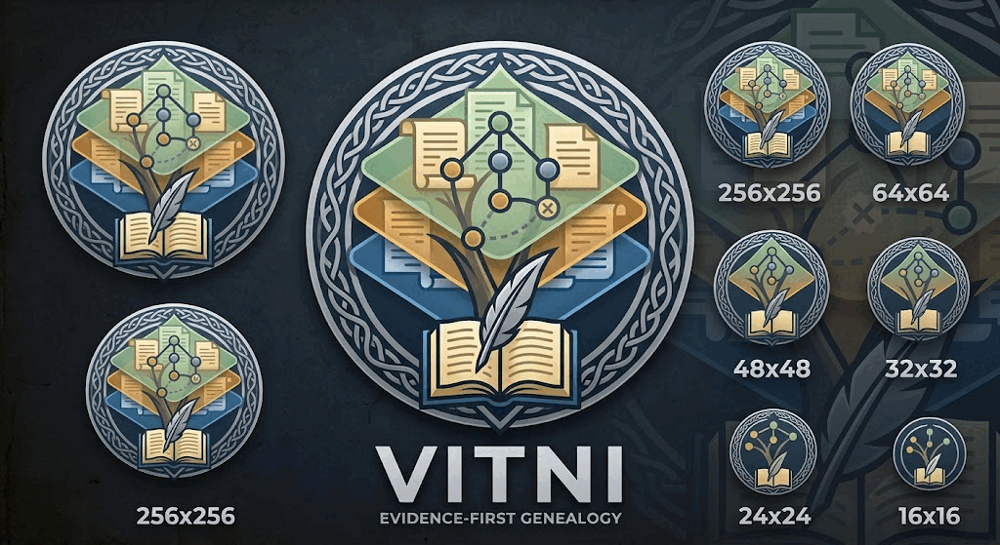

## ChatGPT

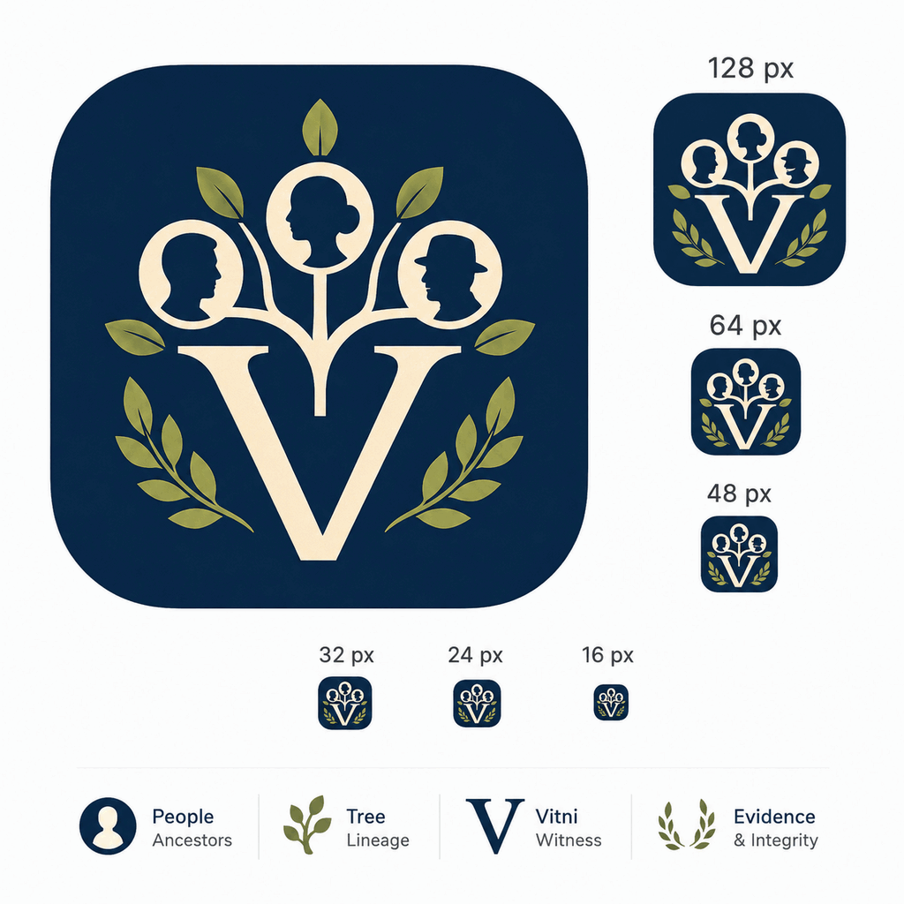

## Grok

### Vitni icon concept

A clean, modern app icon that captures the dual meaning of the name (“witness” in Old Norse) and the program’s core
idea: evidence that stands independent of conclusions.

#### Design description

- Central motif: A stylized, single open eye (the witness). The iris is formed by the silhouette of a branching family
  tree / pedigree, so the act of “seeing” and the genealogical structure are fused.
- Secondary layer: Soft concentric rings or a faint circular seal around the eye, suggesting recorded claims, sources,
  and the immutable event log. The outer edge has a subtle Norse-inspired geometric border (simple interlace or angular
  line work) without becoming ornate or cluttered.
- Color palette (works in both light and dark modes):
  - Deep indigo / slate blue background
  - Warm parchment gold for the tree-iris and accent lines
  - Soft off-white / pale silver for the eye outline and highlights

- Style: Flat / soft-flat vector, high contrast, readable at 16×16 and 1024×1024. No fine detail that disappears when
  small. Slightly rounded square canvas with the standard app-icon corner radius.
- Mood: Calm, authoritative, historical yet contemporary — evidence-first, never flashy.

#### Generated icon

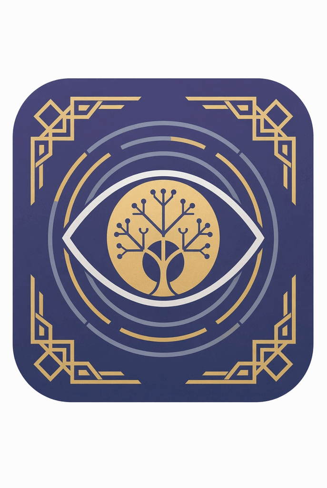

This design keeps the “witness” concept primary while making the genealogical nature instantly readable. The
tree-inside-the-eye communicates that every conclusion is observed and sourced rather than edited in place. The
restrained Norse geometry nods to the Old Norse name without turning the icon into a historical pastiche.

I’ll simplify and strengthen the existing design so it remains clear and legible down to 16×16 px.
Key changes for small-icon suitability:

- Thicker, fewer tree branches (no fine terminal nodes)
- Bolder eye outline
- Simplified or removed delicate corner ornaments
- Stronger concentric rings with higher contrast
- Cleaner negative space so the core “eye + tree” silhouette reads instantly at every size

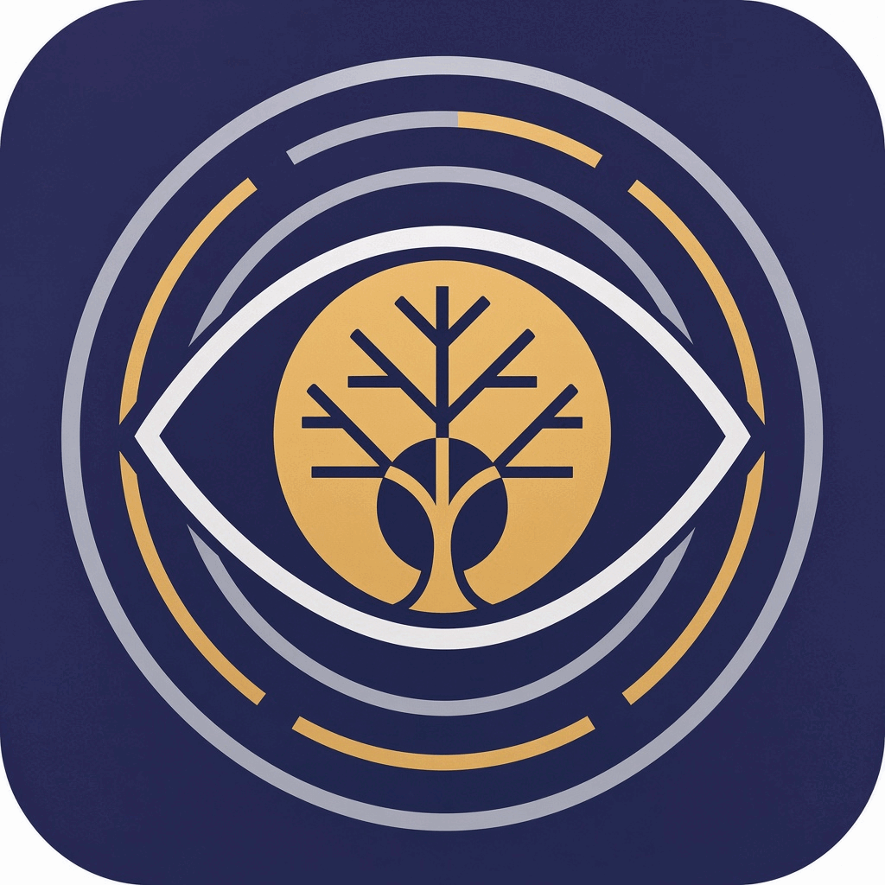

## Qwen

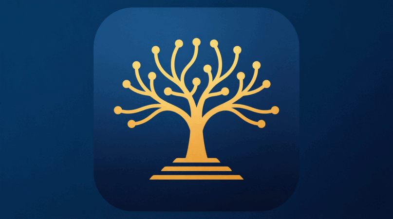

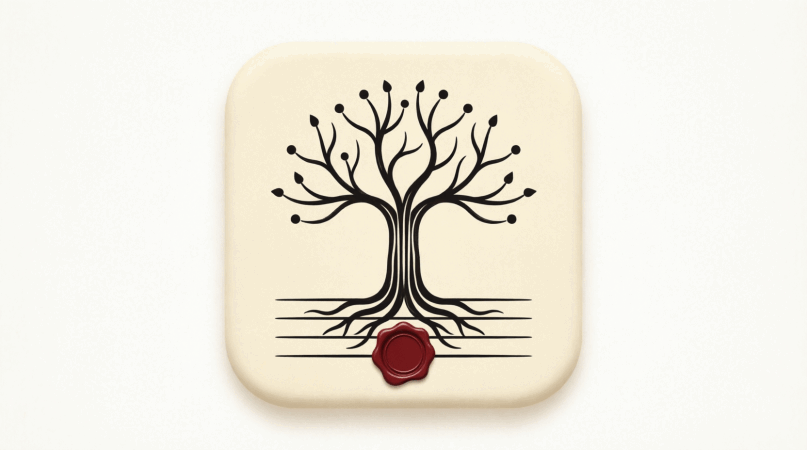

Here are three directions for the Vitni icon, each encoding the program's core idea — _the tree is a conclusion; the
record is the ground it grows from_.

### Concept 1 — "The Tree on the Record" (gold on midnight blue)

A clean gold tree rises out of three stacked horizontal strata: the evidence log. The tree itself is the derived
conclusion, and every branch tip ends in a round node — a person/projection rebuilt from the claims below. The
gold-on-deep-blue palette nods to Norse gilt work while staying fully flat and legible at 16 px. This is the strongest
candidate for the primary app icon: simplest silhouette, best small-size readability.

### Concept 2 — "The Witness Seal" (bronze seal on slate)

Leans into vitni = witness: the tree is embossed inside a wax-seal medallion ringed by a braided Norse knotwork band,
with ribbon tails — an attestation, not just a diagram. The tree's trunk-and-branch geometry echoes the rune ᛉ (Algiz),
and its roots rest on three ledger lines. Rich and characterful, but the 3D embossing will lose detail at small sizes;
best as a splash screen, About-dialog emblem, or document/"signed bundle" badge (a nice fit for your
signed-first-party-plugin distinction).

### Concept 3 — "The Attested Page" (ink on parchment, red seal)

An archival, editorial take: an ink tree whose roots dissolve into ruled ledger lines — the event log — with a single
deep-red wax seal at the base, i.e. every fact is a witnessed claim. The light parchment ground gives you a natural
light-mode companion to Concept 1's dark tile.

### Recommendation

Ship Concept 1 as the primary icon, with Concept 3 as the light-theme variant and Concept 2 as the emblem for
signed/attested artifacts (first-party bundles, exported records). The shared grammar — tree above stacked lines,
dot-nodes — keeps the family coherent.

If you'd like, I can refine any of these: e.g. tighten Concept 1's tree toward the ᛉ rune shape, add the red seal
accent to Concept 1 for a touch of "witness," flatten Concept 2 into a scalable vector-style mark, or produce size
variants (16/32/128/512) and a monochrome glyph. Which direction should I take further?

### Size variants

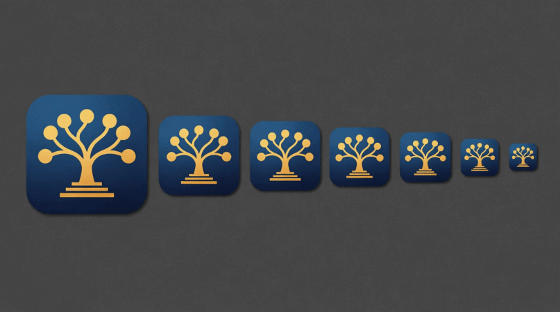

The primary mark is now rebuilt for small-size duty, and the ladder preview confirms it holds up from 256 px down
to 16 px.

#### What changed for small-size legibility

- **Branch count cut from ~18 to 7**, each stroke thickened to a weight that survives downscaling; no hairlines
  remain anywhere in the mark.
- **Terminal nodes enlarged to oversized solid dots**, so at 16 px the tree still reads as "tree with person-nodes"
  rather than a fuzzy blob.
- **Pedestal reduced to three bold, evenly spaced bars** — the evidence-log strata stay distinct instead of merging
  into a smear at 24/16 px.
- **Flat two-color palette** (warm gold on midnight blue), no gradients, shadows or texture inside the mark — pure
  contrast doing the work.
- **Generous, even margins** and deliberate gaps between every stroke, so nothing touches or coalesces when rasterized
  small.
- The silhouette (dotted crown + trunk + three bars) remains recognizable even in the tiniest instance of the
  ladder — the concept's grammar ("the tree is a conclusion grown from the record") survives at favicon scale.

**Reading the ladder:** at 256–128 px the icon is a confident app tile; at 64–48 px (taskbar/dock) the seven nodes
and three bars stay crisp; at 32–24 px (toolbar, list rows) the silhouette and node rhythm hold; at 16 px (favicon)
it still parses as tree-over-lines, which is exactly the threshold this concept was chosen for.

**Optional next steps, if you want them:**

1. A **16 px-specific micro-variant** (five nodes instead of seven) for the last step of the ladder, in case you
   prefer optical sizing over one-size-fits-all.
2. A **monochrome 1-bit glyph** of the same mark for terminal/splash/about-screen use.
3. The **same bolding treatment applied to Concept 3** (parchment/ink/red-seal) so the light-theme companion matches
   this small-size discipline.

## Deepseek

Here’s a clean, symbolic icon concept for Vitni that captures the “evidence-first” and “witness” spirit of the program.

### Symbolism Breakdown

| Element                   | Meaning                                                                                |
| ------------------------- | -------------------------------------------------------------------------------------- |
| Shield / tablet           | The immutable record — a safe, permanent container for all assertions.                 |
| Eye                       | The witness (Vitni). Observation, testimony, and the act of recording a claim.         |
| Quill / pen               | The act of writing an assertion — never erased, only added to.                         |
| Three dots                | The three inseparable layers: evidence, conclusion, and source.                        |
| Chain arc                 | The trail of superseding assertions — every correction links back to the previous one. |
| Gold / dark slate palette | Serious, archival, scholarly — but warm enough to feel human.                          |

### Usage Notes

- **Square format** (512×512) – works for app icons, favicons, and toolbar badges.
- **Monochrome-ready** – if you need a single-color version, simply replace `#f8c630` with your accent color and
  `#2b2d42` with your background.
- **Scalable** – the SVG uses clean geometric primitives; it stays crisp at 16px or 1024px.

Would you like me to tweak the composition (e.g., remove the quill for a more minimalist version, or add a subtle
“paper” texture) or produce a PNG/ICO mockup?

## Copilot

Here’s a complete **icon concept** for _Vitni_ — designed so a graphic designer could implement it, and so you can
evaluate whether it expresses the philosophy of the program.

### 🎯 Core idea

The icon should communicate **witness**, **evidence-first genealogy**, and **non-destructive assertions** — without
looking like a generic family-tree app. The visual metaphor must emphasize _records_, _claims_, and _reconstruction_,
not editing.

### 🧩 Proposed Icon Concept: **The Witness Ledger**

#### **Primary Symbol: The Eye + Ledger**

A stylized **eye** (witness) whose iris is formed by **stacked horizontal lines** (assertions in the event log).

- The eye = _Vitni_ (“witness”).
- The lines = _claims_, _citations_, _operators_, _confidence_.
- The circular form = _reconstruction_ of conclusions from evidence.

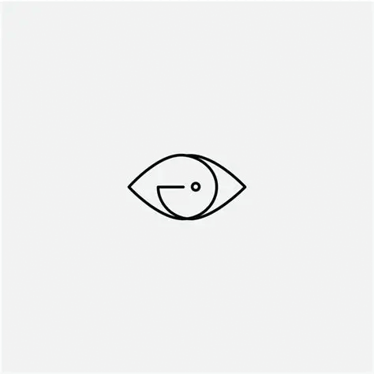 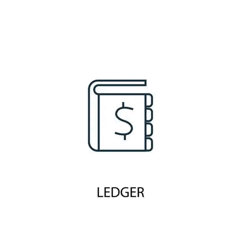 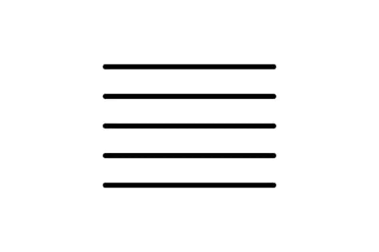

### **Secondary Symbol: Branching Reconstruction**

Inside the pupil, instead of a dot, place a **minimal branching shape** — not a full tree, but a subtle fork of three nodes.

- This represents _conclusions derived from evidence_, not a literal family tree.
- It visually sits _behind_ the ledger lines, reinforcing that conclusions are downstream of evidence.

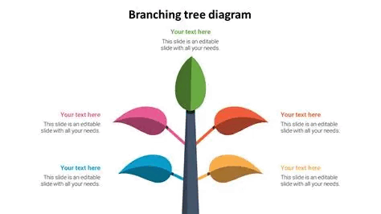 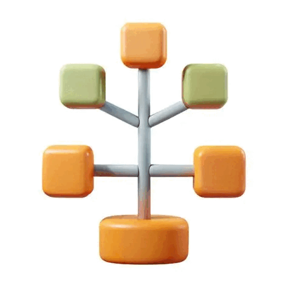 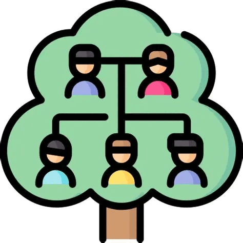 

### 🎨 Style & Aesthetic

#### **Shape**

- Rounded square app icon.
- Clean geometric lines.
- Slight asymmetry in the ledger lines to imply _human operators_ and _real-world claims_.

#### **Color Palette**

- **Deep indigo (#2A2F6B)** — seriousness, archival trust.
- **Soft gold (#D9A441)** — historical record, parchment.
- **Cool gray (#E5E7EB)** — neutrality and evidence.
- Optional accent: **Nordic blue (#4C7BBE)** to nod to Old Norse roots.

#### **Contrast**

- Eye outline in gold.
- Ledger lines in gray.
- Branching reconstruction in indigo.

### 🧱 Symbolic Breakdown

- **Eye** → witness, observation, operator identity.
- **Ledger lines** → assertions, citations, confidence, timestamps.
- **Branching nodes** → conclusions rebuilt from evidence.
- **Circular iris** → reconstruction pipeline.
- **Color palette** → archival + Nordic heritage.
- **Minimalism** → modern WebAssembly, sandboxed plugins, Fluent localization.

### 📐 Detailed Designer Specification

#### **Geometry**

- Outer icon: 20% corner radius.
- Eye shape: centered, width 70% of icon.
- Iris circle: 45% of icon width.
- Ledger lines: 3–5 horizontal strokes, each 60% of iris width, slightly offset.
- Branching nodes: 3 circles (6% width each) connected by thin lines.

#### **Line Weight**

- Eye outline: 2.5× ledger line thickness.
- Branching diagram: 0.75× ledger line thickness.

#### **Texture**

- Very subtle grain in background (2–3% noise) to evoke archival paper.
- Foreground symbols remain flat and crisp.

### 🧬 Optional Variants

#### **Variant A — “The Immutable Log”**

Replace the eye with a **stylized rune-like shape** referencing Old Norse _vitni_.

- More historical.
- Less universal.

#### **Variant B — “The Dual Layer”**

Split the icon horizontally:

- Top: ledger lines (evidence).
- Bottom: branching nodes (conclusions).
- A thin gold bar separates them.

#### **Variant C — “The Seal”**

Circular badge with the eye + ledger inside a ring of runic dots.

- Evokes authenticity and non-destructive recordkeeping.

### 🧭 Next step

If you want, I can produce:

- A **vector-ready specification** (SVG layout)
- A **color-only version** (palette refinement)
- A **symbol-only logo** (monochrome mark)
- A **full branding system** (brand kit)

Which direction would you like to explore next?

## Perplexity

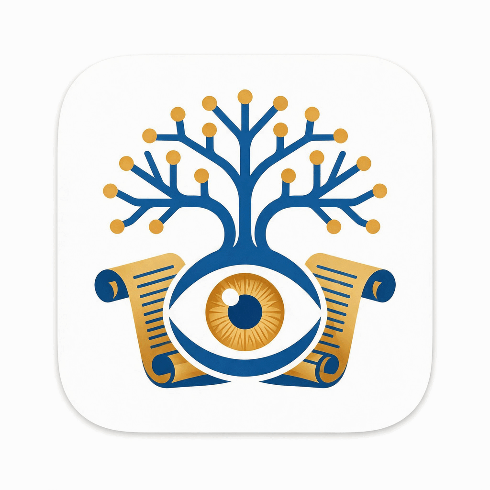

> Stylize the image so that it's suitable for icons size 256, 128, 64, 48, 32, 24, and 16 pixel square.

I’ve hit the image generation rate limit for this month. You can still get the icon set you need in one of these ways:

### Option 1 — Use the first concept and resize it

If you still have access to the first generated image (`vitni-icon-concept.png` from your artifacts), you can:

1. Open it in an image editor (Figma, Sketch, Affinity, Photoshop, or even GIMP).
2. Export as PNG at these exact sizes: **256, 128, 64, 48, 32, 24, 16** pixels.
3. For 32 px and below, slightly increase contrast and simplify any fine details so the tree/witness motif stays readable.

### Option 2 — Quick manual stylization guidelines

To make the icon work well at all those sizes, especially 16–32 px:

- **Composition**
  - Keep the main motif centered with generous padding (about 10–15% on each side at 256 px).
  - Use a single clear silhouette: a simple tree shape (trunk + 2–3 branches with nodes) overlaid or merged with a
    subtle “eye” or document corner to suggest “witness” and “recorded claim”.
- **Detail level**
  - At 256 px: you can show 3–4 nodes on the tree and a small eye/scroll detail.
  - At 64–48 px: reduce to 2–3 nodes; simplify the eye/scroll to a basic shape.
  - At 32–16 px: use only the essential silhouette: a Y-shaped tree with 2 nodes and a single contrasting accent
    (e.g., a small circle or wedge) to hint at the witness/record idea.
- **Color**
  - Stick to 2–3 colors: deep blue background/shape, gold/amber accent for the “witness” element, and white/negative
    space for separation.
  - Avoid gradients for the smallest sizes; flat colors read better.
- **Edges**
  - Align key edges to whole pixels when exporting each size to avoid blur.
  - For 24/16 px, remove any drop shadows or thin outlines; rely on solid shapes and color contrast.

### Option 3 — I can generate the icon set once limits reset

When your image generation limit resets (or if you upgrade), I can:

- Regenerate a master icon specifically designed for small sizes.
- Then automatically export it as a full set:
    `vitni-icon-256x256.png`, `vitni-icon-128x128.png`, `vitni-icon-64x64.png`, `vitni-icon-48x48.png`,
    `vitni-icon-32x32.png`, `vitni-icon-24x24.png`, `vitni-icon-16x16.png`.

If you’d like, describe any adjustments you want to the concept (e.g., “more tree, less eye”, “use only blue and white”,
“make it more Nordic/runic”), and I’ll refine the prompt for when you regenerate.

## Review

What the set produced, and what came out of it.

### Rejected, and why

- **A tree** — every Qwen concept, both Gemini boards, both ChatGPT boards, Copilot 4–7, Perplexity and
  both Grok icons. This is the one thing the icon may not be: Gramps, Ancestry and MyHeritage all use a
  tree, and the README deliberately de-emphasises the tree in favour of the record it is derived from. The
  engines reached for it because "genealogy" in training data *is* a tree.
- **An eye** — Grok 1–2, Copilot's written spec, both Deepseek SVGs, Perplexity. On a program holding
  living people's personal data an eye reads as surveillance, and a ringed eye adds Providence and
  conspiracy freight. *Vitni* is a witness in the sense of testimony, not of watching.
- **Fictional size ladders** — the "16×16" tiles in `gemini-2.png`, `chatgpt-2.png` and `qwen-5.png` keep
  their portrait medallions, laurel and knotwork intact. No downscaler produces that; an image model drew
  what it thinks a small icon looks like. `deepseek-2.svg` is the only real ladder in the set, with
  per-size simplification (it drops three dots to one at 16 px) — the right discipline, though its mark at
  that size is a ring with a diagonal through it, which reads as "prohibited" or "search".
- **Stock clipart presented as concepts** — `copilot-2.png` is a finance ledger icon with a dollar sign
  and the word LEDGER, `copilot-4.png` a PowerPoint "Branching tree diagram" slide with *"Your text here"*
  placeholders, `copilot-6.png` kids-app clipart. `image.png` duplicates `perplexity-1.png`.
- **Unbuildable detail budgets** — Norse interlace bands, embossed 3-D wax, ruled parchment and portrait
  silhouettes (Gemini, ChatGPT 1, Qwen 2–3). Splash or About-dialog art at best; Qwen says as much about
  its own Concept 2.

### Adopted

- **Gold on deep navy, flat.** The shipped mark had been `#6cb6ff` — the app's own `--accent` — so the
  icon read as a chip from its own toolbar. Gold also holds 16 px contrast better on both grounds.
- **A seal that looks pressed.** ChatGPT's red wax seal with a gold V (`chatgpt-1.png`) is the strongest
  single element anyone produced, and it is this project's own concept executed with conviction. The mark's
  seal became an impressed ring and chevron rather than a 4-unit nick.
- **The record under the conclusion.** Qwen's stacked strata and Copilot's ledger lines, as three ruled
  lines the V stands in — this project's actual thesis, three shapes rather than eighteen branches, and
  not what any other genealogy icon does.
