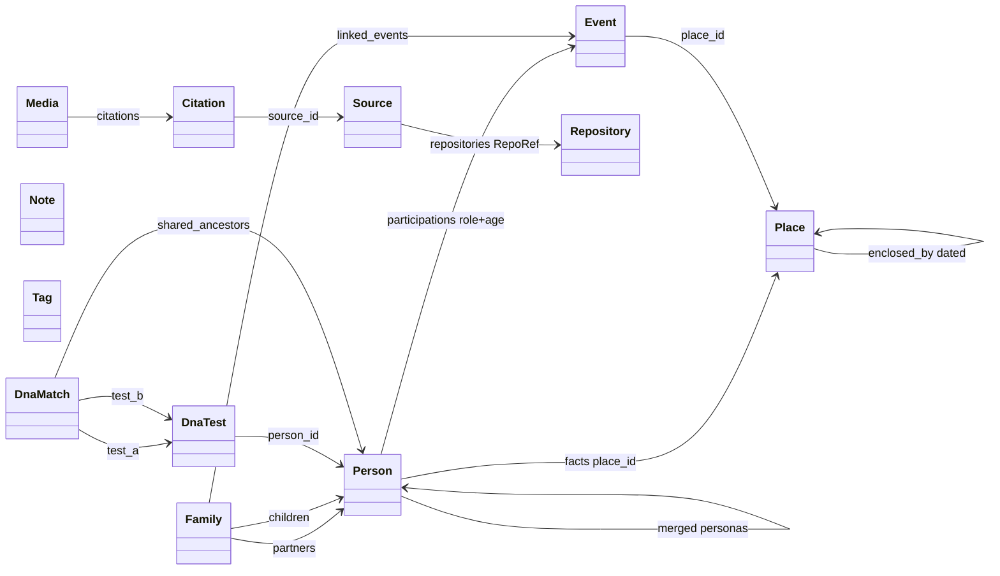
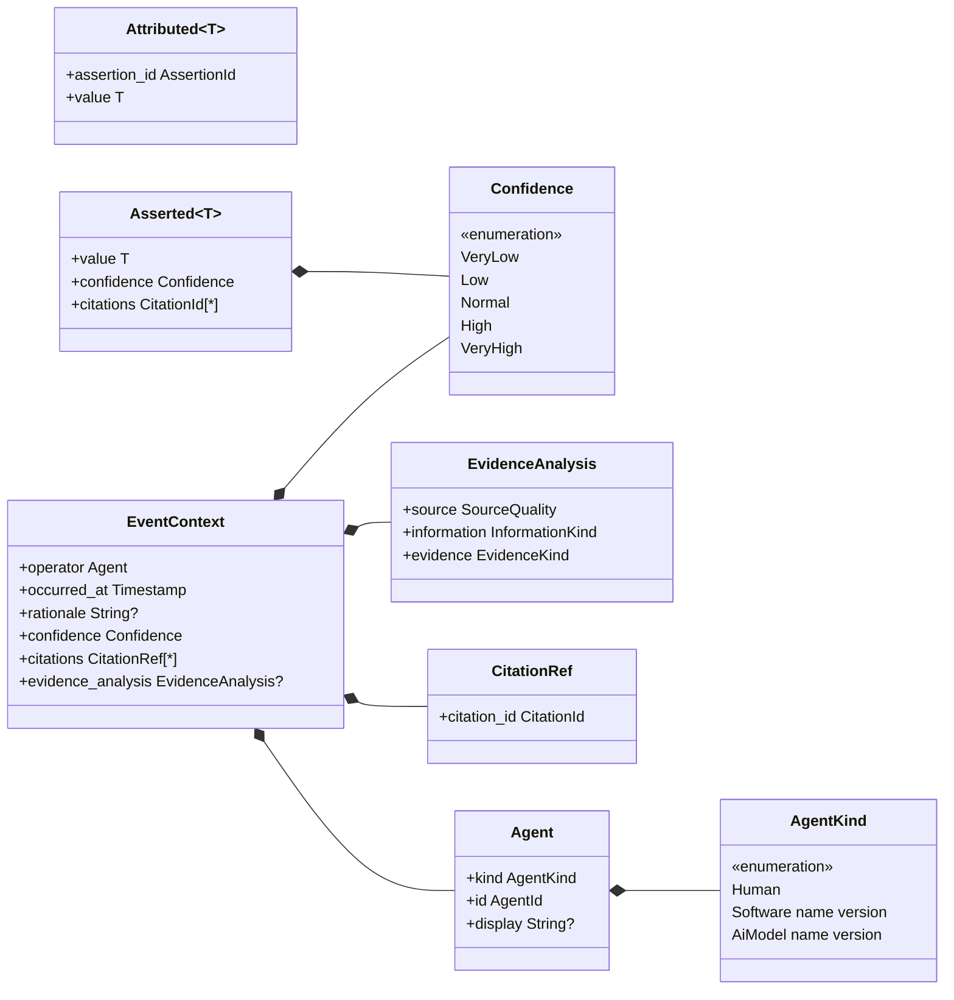
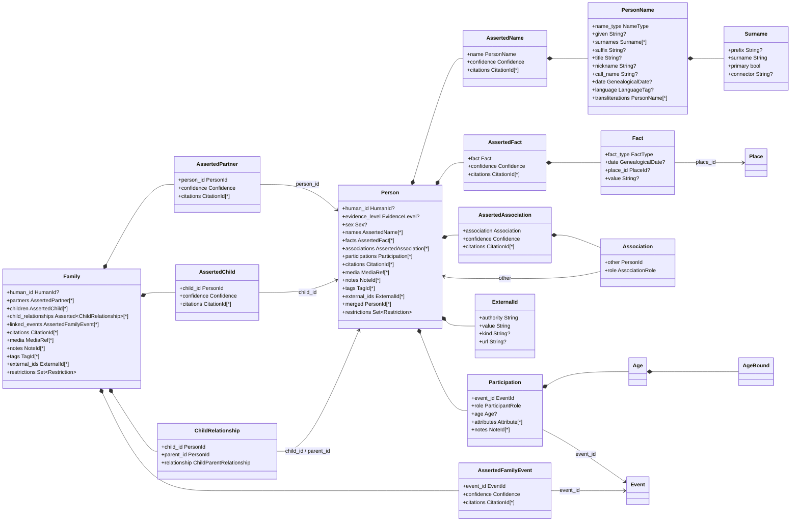
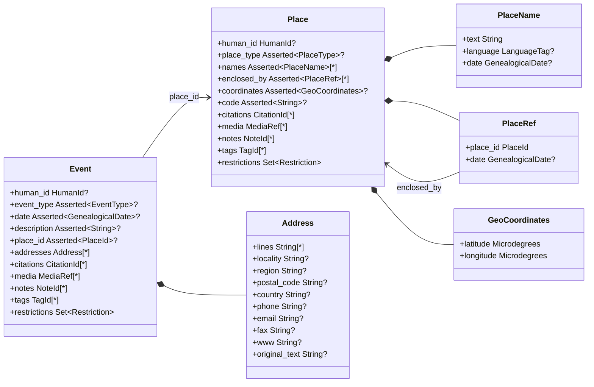
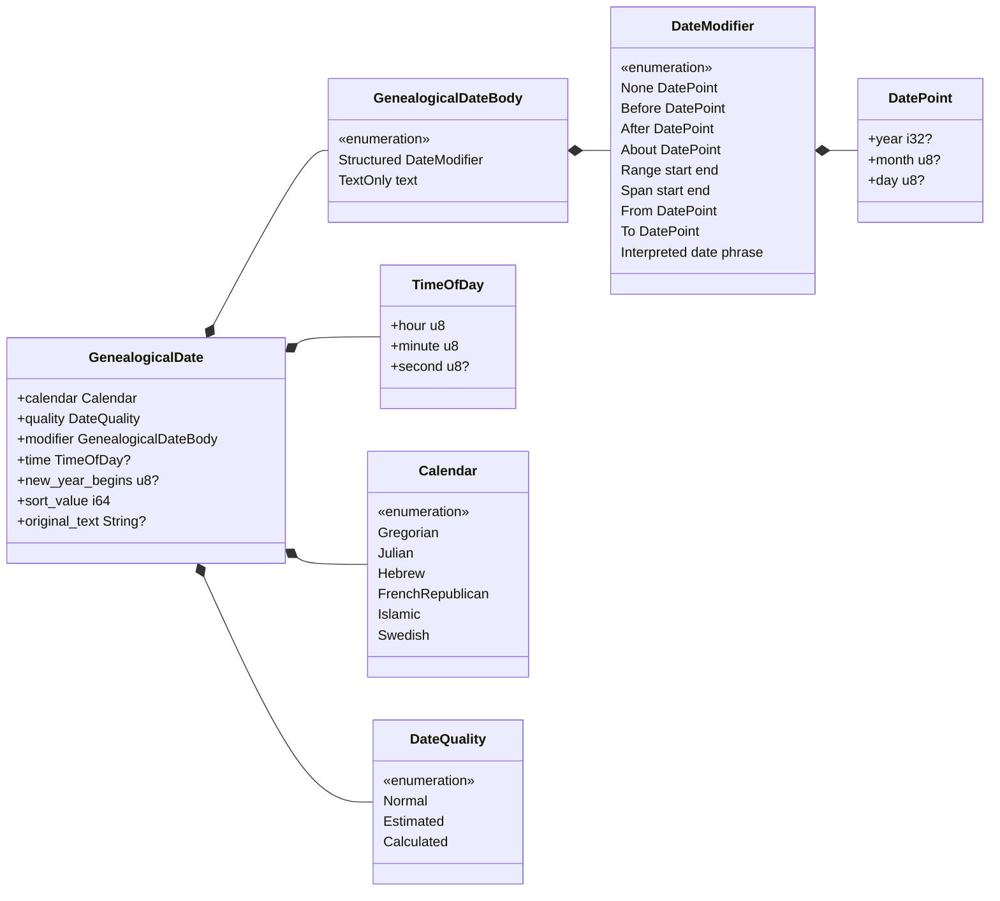
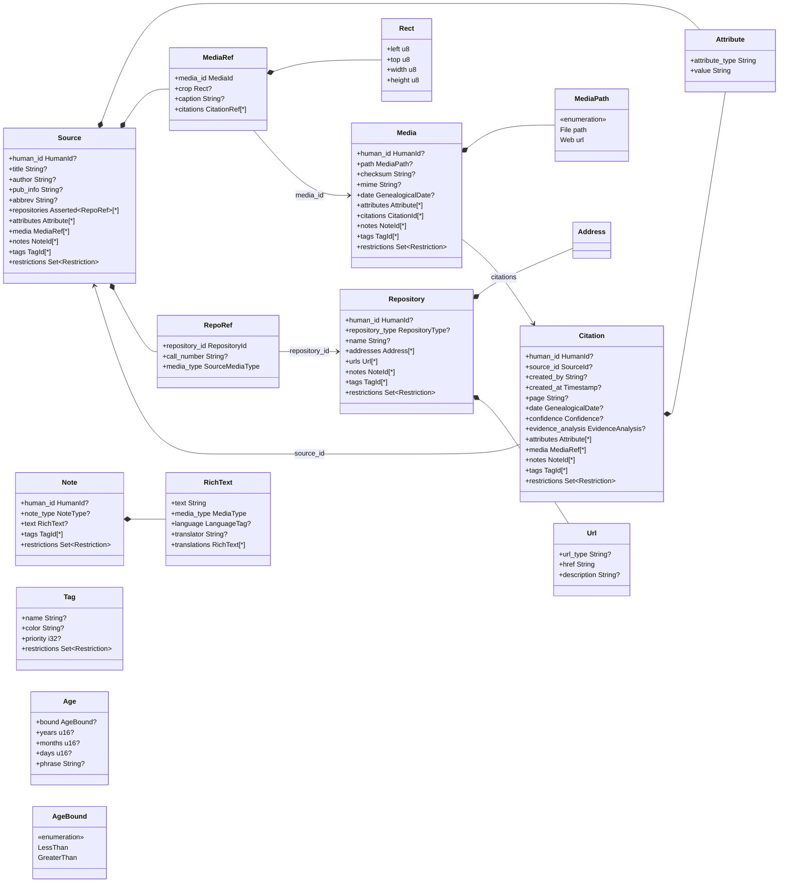
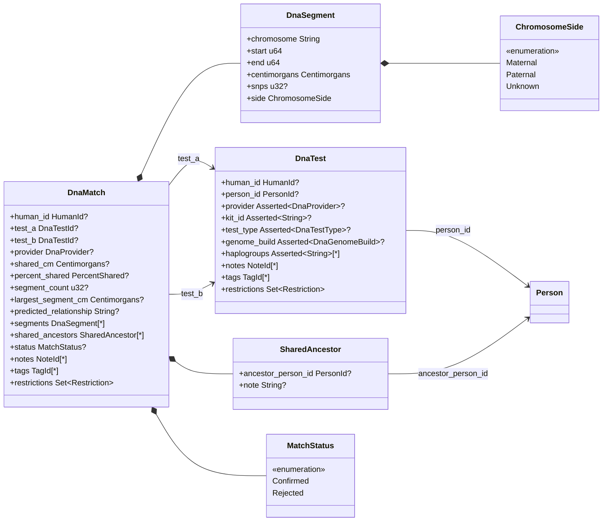

# Data-model class diagrams

- **Status:** Generated from code — regenerate when aggregate state changes
- **Date:** 2026-07-10
- **Source of truth:** `crates/genealogy-core/src/<aggregate>/state.rs` (+ `view.rs`); see
  [data-model.md](data-model.md) for the narrative model.

Class diagrams of the twelve aggregates (conclusion-layer shape) and the value objects they embed.
Each aggregate's `*View` wraps its `*State` and exposes the same shape, so one class per aggregate
is drawn, named after the aggregate.

## Legend

| Notation | Meaning |
| --- | --- |
| `T?` | `Option<T>` |
| `T[*]` | `Vec<T>` |
| `Set~T~` | `BTreeSet<T>` |
| `Asserted~T~` | row carries denormalized provenance: `{ value: T, confidence, citations }` |
| solid arrow `-->` | cross-aggregate reference — an **id link carried in event payloads**, never an object reference |
| `*--` | composition — value object embedded in the owning payload |
| `«enumeration»` | an enum; the lines below it are its variants (plain text instead of Mermaid's `<<…>>` annotation, which some Markdown previews mangle as HTML) |

Conventions:

- The `Attributed<T>` wrapper (`{ assertion_id, value }` — tags every asserted row with the
  assertion that introduced it, so retract/supersede can remove exactly that row) is **elided on
  every field**; see the provenance substrate diagram for its shape.
- `Asserted~T~` (and the bespoke `AssertedName` / `AssertedFact` / `AssertedPartner` / … structs)
  are shown, because whether a row denormalizes confidence + citations differs per field.
- Bookkeeping fields are omitted: `exists`, `live_assertions`, the aggregate's own id, and
  `restrictions_assertion` (Person only).
- Attachment links every aggregate carries (notes / tags / media / citations) are listed as fields
  and summarized in the [attachment matrix](#attachment-matrix), but not drawn as overview edges —
  they would dominate the picture.

## Overview — aggregates and cross-aggregate links

Participation is owned by a single aggregate: the Person asserts
`participations (event_id, role, …)` (ADR 0019). An Event's participant list is a **projection**
over the person-side rows that reference it — the Event aggregate holds no participation state, so
there is one owner and one correction handle (the person-side `AssertionId`).

### Attachment matrix

Which aggregate carries which attachment/link lists (all `Vec<Attributed<…>>` unless noted):

| Aggregate | citations | media | notes | tags | external_ids | addresses | attributes | restrictions |
| --- | :-: | :-: | :-: | :-: | :-: | :-: | :-: | :-: |
| Person | ✓ | ✓ | ✓ | ✓ | ✓ | — | — | ✓ |
| Family | ✓ | ✓ | ✓ | ✓ | ✓ | — | — | ✓ |
| Event | ✓ | ✓ | ✓ | ✓ | — | ✓ | — | ✓ |
| Place | ✓ | ✓ | ✓ | ✓ | — | — | — | ✓ |
| Source | — | ✓ | ✓ | ✓ | — | — | ✓ | ✓ |
| Citation | — | ✓ | ✓ | ✓ | — | — | ✓ | ✓ |
| Repository | — | — | ✓ | ✓ | — | ✓ (+urls) | — | ✓ |
| Media | ✓ | — | ✓ | ✓ | — | — | ✓ | ✓ |
| Note | — | — | — | ✓ | — | — | — | ✓ |
| Tag | — | — | — | — | — | — | — | ✓ |
| DnaTest | — | — | ✓ | ✓ | — | — | — | ✓ |
| DnaMatch | — | — | ✓ | ✓ | — | — | — | ✓ |

A Source has no `citations` list because a Source is what citations point *into*.
Tag has no assertion chain at all (no `Attributed` rows, no `live_assertions`) — its fields are
last-writer-wins setters.

## Provenance substrate

The wrappers elided in the detail diagrams, and the envelope every stored event embeds
(`provenance.rs`, `assertions.rs`):

`Asserted<T>` is not stored independently: it is **denormalized from the asserting event's
`EventContext` at fold time** (confidence + citation ids), so read models can show per-row surety
without re-reading the log. The Person and Family aggregates use bespoke equivalents
(`AssertedName`, `AssertedFact`, `AssertedAssociation`, `AssertedPartner`, `AssertedChild`,
`AssertedFamilyEvent`) instead of the generic `Asserted<T>`.

## Person & Family

`AssertedChild` is the child's **membership** only; each child-to-partner relationship is a separate
`ChildRelationship` row (`child_id`, `parent_id`, `ChildParentRelationship` — GEDCOM `_FREL`/`_MREL`),
so an adoption link can be retracted or re-cited without disturbing the membership or the other links
(ADR 0021). `FamilyView::children()` reconstructs the per-partner tuple list by folding the
`ChildRelationship` rows onto the membership. `ChildRelationship` rides the shared `Asserted~T~`
wrapper (`{ value, confidence, citations }`) like every other denormalized row.

## Event & Place

### GenealogicalDate

Used by Person names/facts, Event, Place names/refs, Citation, and Media.

## Evidence: Source, Citation, Repository, Media, Note, Tag

`Address` appears here without fields — its shape is drawn once, in the Event & Place diagram.

## DNA

`Centimorgans` and `PercentShared` are fixed-decimal integer newtypes (`i64`), not floats, so
match observations compare exactly and round-trip losslessly.

## Enumerated types

Closed enums with a `Custom(String)` escape hatch unless noted (data-model §7).

| Enum | Variants |
| --- | --- |
| `Sex` | Male, Female, Unknown, Intersex, Other(String) |
| `Restriction` (closed) | Confidential, Locked, Privacy |
| `EvidenceLevel` (closed) | Persona, Conclusion |
| `NameType` | BirthName, MarriedName, Maiden, Immigrant, Professional, AlsoKnownAs, ReligiousName, Custom |
| `FactType` | Birth, Death, Baptism, Burial, Occupation, Residence, Religion, Caste, PhysicalDescription, Education, Ethnicity, NationalId, Nationality, NumberOfChildren, NumberOfMarriages, Property, SocialSecurityNumber, NobilityTitle, Custom |
| `EventType` | Birth, Death, Marriage, Baptism, Christening, Burial, Cremation, Census, Residence, Immigration, Emigration, Adoption, Confirmation, BarMitzvah, BasMitzvah, FirstCommunion, Graduation, Naturalization, Ordination, Probate, Retirement, Will, Engagement, Annulment, Divorce, DivorceFiled, MarriageBanns, MarriageContract, MarriageLicense, MarriageSettlement, Custom |
| `ParticipantRole` | Primary, Witness, Officiator, Clergy, Father, Mother, Parent, Child, Husband, Wife, Spouse, Godparent, Friend, Neighbour, Multiple, Bride, Groom, Custom |
| `AssociationRole` | Clergy, Friend, Godparent, Neighbour, Officiator, Witness, Child, Father, Mother, Parent, Husband, Wife, Spouse, Multiple, Custom |
| `ChildParentRelationship` | Birth, Adopted, Foster, Step, Sealed, Unknown, Custom |
| `PlaceType` | Country, County, Municipality, Parish, City, Town, Village, Farm, Building, Custom |
| `RepositoryType` | Library, Archive, Church, Cemetery, Museum, Website, Collection, Custom |
| `SourceMediaType` | Book, Card, Electronic, Fiche, Film, Magazine, Manuscript, Map, Newspaper, Photo, Tombstone, Video, Audio, Custom |
| `NoteType` | General, Research, Transcript, Citation, Custom |
| `DnaProvider` | AncestryDna, TwentyThreeAndMe, MyHeritage, FamilyTreeDna, GedMatch, LivingDna, Custom |
| `DnaTestType` (closed) | Autosomal, YDna, MtDna, XDna |
| `DnaGenomeBuild` (closed) | GRCh37, GRCh38 |

## Identifier newtypes (`ids.rs`)

UUID v7 newtypes: `PersonId`, `FamilyId`, `EventId`, `PlaceId`, `SourceId`, `CitationId`,
`RepositoryId`, `MediaId`, `NoteId`, `TagId`, `DnaTestId`, `DnaMatchId`, `AssertionId`, `AgentId`.
`HumanId` is a `String` newtype (the user-facing `gramps_id` analog).
